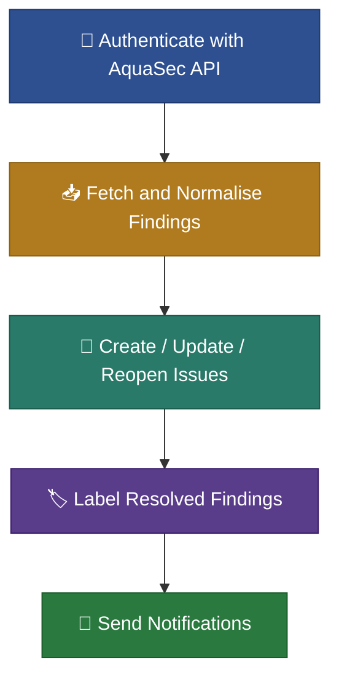

# Security Automation

## Overview

Security Automation provides **continuous, automated vulnerability management** for your repositories. It authenticates directly with the AquaSec API, fetches scan findings, and automatically converts them into structured **GitHub Issues** with full lifecycle management. This gives your team a managed security posture without manual triage effort.

> For setup instructions and technical configuration, see the [Security README](/src/security/README.md).

---

## How It Works

This solution authenticates with the AquaSec API, fetches scan findings, and converts them into a managed GitHub Issues backlog.

> **Note:** This solution currently supports the AquaSec scanner only.



1. **Authenticate with AquaSec**: The pipeline authenticates using HMAC-SHA256 signed credentials to obtain a bearer token from the AquaSec API.

2. **Fetch and Normalise Findings**: Scan results are fetched directly from the AquaSec Code Security API (paginated), then parsed and normalised into a common format extracting severity, rule ID, affected file, and a stable fingerprint for matching.

3. **Create / Update / Reopen Issues**: New findings become new GitHub Issues. Existing findings are updated with the latest occurrence data. Previously closed findings that reappear are automatically reopened. Parent issues (epics) group findings by rule and auto-close when all children are resolved.

4. **Mark Resolved Findings**: Issues for findings that are no longer detected are labelled `sec:adept-to-close`, signalling they are ready to be closed manually.

5. **Send Notifications**: When new or reopened findings are detected a notification can be sent automatically.

---

## Key Benefits

- **Zero manual triage**: New findings from AquaSec scans automatically become Issues with severity, context, and links to the affected code.
- **Single source of truth**: GitHub Issues is the system of record. No need to check a separate security portal.
- **Lifecycle automation**: Issues are reopened when findings reappear, labeled for closure when resolved, and updated if needed.
- **Notifications**: Option to notify the team of new or reopened security findings in real-time.
- **Priority sync**: Findings are mapped to priority levels on a ProjectV2 board, keeping planning and security aligned.
- **Organisational scale**: Shared reusable workflows mean every repository gets the same security process with a single caller workflow.

---

## What You See in GitHub

After a successful run, findings appear as a GitHub Issues with defined body structure. Fields that are not available for a given finding are not shown for clarity.

### Security Issue (Child)

**Title:** `[SEC:CRITICAL][FP=a1b2c3d4] requests: Improper certificate verification allows MITM attacks`

**Labels:** `scope:security`, `type:tech-debt`

```markdown
<!--secmeta
type=child
fingerprint=a1b2c3d4e5f6789012345678abcdef01
repo=my-org/my-service
rule_id=CVE-2024-99999
severity=critical
gh_alert_numbers=["7"]
-->

## General Information

- **Severity:** critical
- **Title:** requests: Improper certificate verification allows MITM attacks
- **Category:** vulnerabilities
- **Rule:** CVE-2024-99999
- **Alert hash:** a1b2c3d4e5f6789012345678abcdef01
- **First seen:** 2026-01-15

## Description

The requests library before 2.32.0 does not properly verify SSL certificates when
the `verify` parameter is set to a path that does not exist. This allows a
man-in-the-middle attacker to intercept HTTPS traffic. Fixed in requests 2.32.0.

## Location

- **Repository:** my-org/my-service
- **File:** pyproject.toml
- **Start Line:** 12
- **End Line:** 12

## Dependency Details

- **Package name:** requests
- **Installed version:** 2.28.1
- **Fixed version:** 2.32.0
- **Reachable:** True
```

### Rule Issue (Epic)

Each unique rule (e.g. a specific CVE) gets a parent issue that groups all individual findings. The parent is automatically closed when all its children are resolved.

**Title:** `Security Alert – CVE-2024-99999`

**Labels:** `scope:security`, `epic`

```markdown
<!--secmeta
type=parent
repo=my-org/my-service
rule_id=CVE-2024-99999
severity=critical
-->

## General Information

- **Title:** requests: Improper certificate verification allows MITM attacks
- **Category:** vulnerabilities
- **Severity:** critical
- **Published date:** 2024-11-05
- **Short Description:** requests: Improper certificate verification allows MITM attacks

## Affected Package

- **Package name:** requests
- **Fixed version:** 2.32.0

## Classification

- **Rule:** CVE-2024-99999
- **Category:** vulnerabilities
- **Advisory URL:** https://access.redhat.com/security/cve/CVE-2024-99999

## References

- https://access.redhat.com/security/cve/CVE-2024-99999
- https://github.com/psf/requests/security/advisories/GHSA-0000-0000-0000
- https://nvd.nist.gov/vuln/detail/CVE-2024-99999
```

---

## Getting Started

Adopt the security automation by adding a short caller workflow to your repository.

### Workflow Secrets

| Secret | Required | Purpose |
| --- | --- | --- |
| `AQUA_KEY` | Yes | AquaSec API key |
| `AQUA_SECRET` | Yes | AquaSec API secret |
| `AQUA_GROUP_ID` | Yes | AquaSec group identifier |
| `AQUA_REPOSITORY_ID` | Yes | AquaSec repository identifier |
| `TEAMS_WEBHOOK_URL` | No | Teams webhook for real-time alerts |

### Example Caller Workflow

See the full example at [docs/security/aquasec-night-scan-example.yml](/docs/security/aquasec-night-scan-example.yml).

---

## See Also

- [Security README](/src/security/README.md): setup instructions, shared workflow configuration, and technical details
- [Example Caller Workflow](/docs/security/aquasec-night-scan-example.yml): ready-to-copy workflow file for your repository
- [Repository README](/README.md): overview of all organizational workflows
